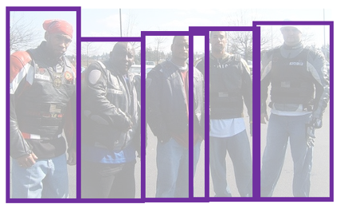
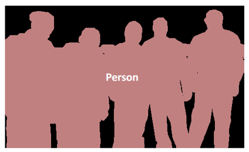
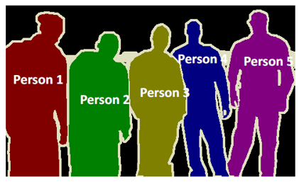
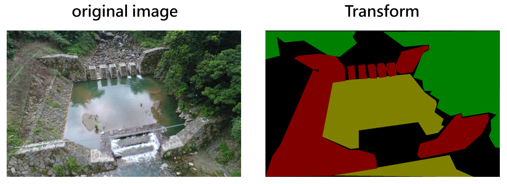
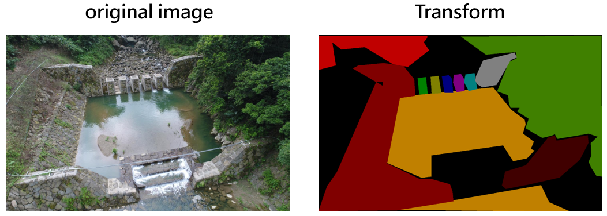
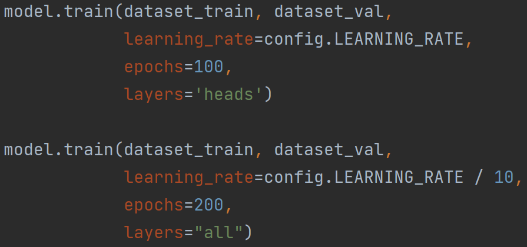
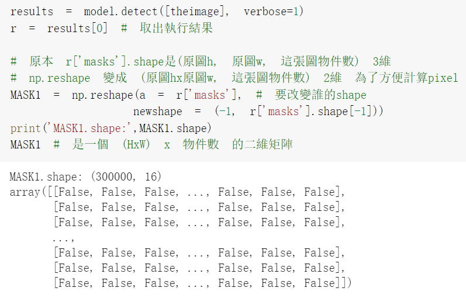
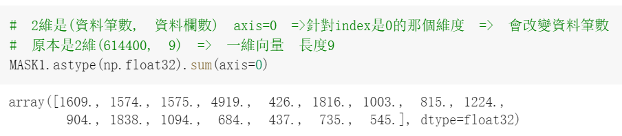
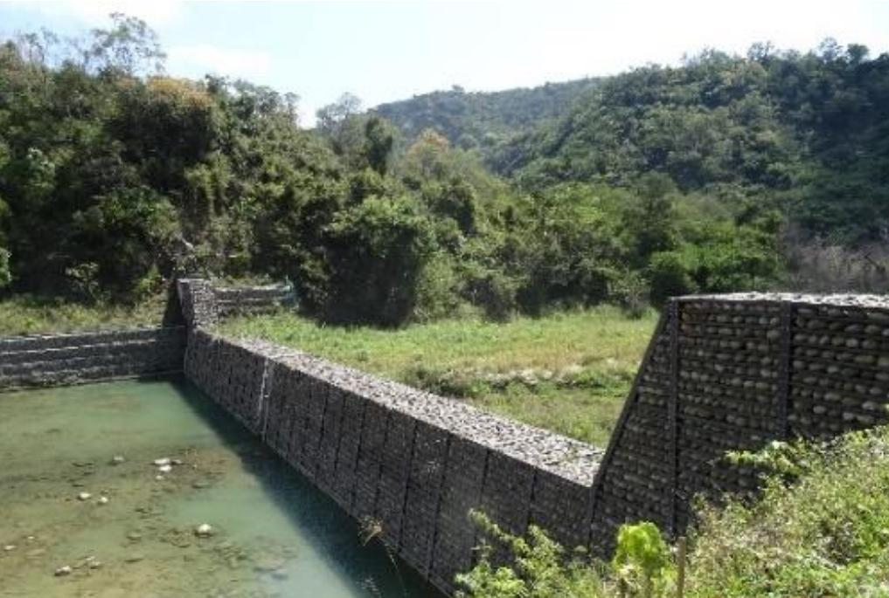
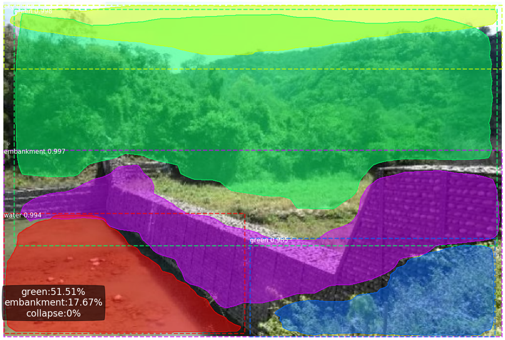

本任務希望可以對山坡圖片做Instance Segmentation，要區分的類別有「堤防」、「天空」、「土石坍塌」、「Green」、「水」等。
## CV Task:Instance Segmentation
#### Object Detection

物件偵測:用矩行框把物件一個一個框出來，可以區分個體，但不能切割出輪廓。

#### Semantic Segmentation

語意分割:可以精細的切出輪廓但不能區分個體，像是這張圖片可以知道這團都是人但不知道有幾個人

#### Instance Segmentation

Instance Segmentation 會對圖片中的每一個像素點做分類,並且區分不同的物件。圖中的人可以區分個體又可以切割出輪廓。
  
Source : https://www.muhendisbeyinler.net/mask-r-cnn-bir-nesne-tanima-algoritmasi/


## pre-processing : Label, Transform 
使用Labelme對圖片座標註，每張圖片都有一個對應的 json 檔，要把 json 檔轉成可以餵給模型的格式，使用 labelme/Scripts 資料夾底下的`labelme_json_to_dataset.exe`來進行轉檔。  
```
python run_json.py
```

要注意的是，由於此任務是做Instance Segmentation，因此在標註、轉檔時要特別注意「希望區分個體的類別」。  
以本任務為例，希望「堤防」、「Green」、「土石坍塌」可以區分個體，剩下的「天空」、「水」則不需要區分個體。
##### 錯誤示範

從上圖錯誤示範可以觀察到，並沒有對「堤防」和「Green」區分個體，表示標註、轉檔出了一些問題。如果將其直接餵給Mask RCNN模型做訓練，會無法達到預期希望「堤防」、「Green」、「土石坍塌」要區分個體的效果。

##### 正確示範

從上圖正確示範可以觀察到，這次有確實將「堤防」和「Green」區分個體，並且「水」這個類別不區分個體。

## Deep learning framework
Tensorflow : 1.15  
Keras : 2.3.1


## Training
##### 注意參數 
MODEL_DIR : 權重檔生成位置
NUM_CLASSES = 1(背景) + <label總量>   
TRAIN_ROIS_PER_IMAGE : 訓練時每張圖要生成多少ROIs  
  
dataset_root_path : 訓練資料集(原圖+轉檔後的mask)路徑  
init_with : 要從頭訓練或是做Transfer learning

設定epoch  
  
layers='head' 的意思是只訓練heads層，也就是Backbone的(預訓練)權重先凍結，先訓練其他層的權重。  
layers='all'  的意思是整個模型的權重都訓練，設定時數字要大於等於前者。  
以上圖為例，會先在凍結Backbone權重的情況下先訓練100 epochs，再將整個模型的權重一起訓練 (200-100) epochs 。

```
python train.py
```

## Inference
本任務希望在偵測時，有些類別要區分個體，但最後還是會計算這張圖中各類別的總面積，來計算占整張圖的比例。
  
要計算面積在這份code中可以善用 r\['masks'\]。  
以下圖為例，先是經過轉換後得知這張圖有300000個pixels，模型偵測出16個Instances。  
下圖中 MASK1是一個二維矩陣，其值為 True 或 False。 True就是這個pixel屬於該個Instance，反之為False。    


下圖中 將 MASK1 針對第0軸做加總，就可以得到這張圖中16個Instances 各自佔的 pixels 數。
  
後續可以將相同類別的Instance自行加總，再除以原圖的 Pixels 總數，就可以求得本任務需要的各類別占整張圖的比例!


##### 注意參數 
weights : 以訓練完成的權重檔  
input_folder : 要做 Inference 的圖片都放到這個資料夾，並輸入其路徑  
output_folder : 做完 Inference 後存結果的資料夾路徑  
gpu : 設定是有使用GPU

```
python myInference.py \
--weights myweight.h5 \
--input_folder images \
--output_folder output_space \
--gpu True
```


input:  


Inference:  
  
給 Mask RCNN 做 Instance Segmentation 後，可以看到有兩個類別為「Green」的Instances 有被區分出來，也有印出感興趣的類別在整張圖片中所佔的比例。  
不過也發現輪廓還切割得不夠精細，是因為 Mask RCNN 的參數量較龐大，做 Instance Segmentation 的訓練時間也比較長，在 Colab 中只夠訓練10個 epochs 就被迫斷線了。  
若在計算力強大且穩定的設備上做訓練更多個 epochs，可以讓模型切割得不夠精細。


## Reference
[1] https://github.com/matterport/Mask_RCNN
[2] He, K., Gkioxari, G., Dollár, P., & Girshick, R. (2017). Mask r-cnn. In Proceedings of the IEEE international conference on computer vision (pp. 2961-2969).
